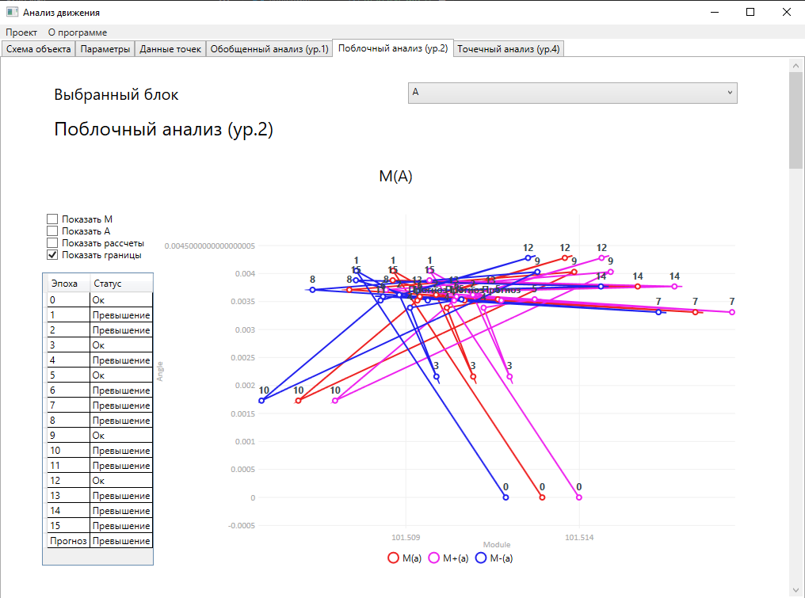

# CourseWPF

Курсовая программа по анализу движения точек объекта (здания), реализованная на WPF.

Вид интерфейса:


## Справка [./docs.md](./docs.md)

Справка, с объяснением использования программы, доступна здесь: [./docs.md](./docs.md)

## Сборка

### dotnet build
```
$ dotnet build
  Determining projects to restore...
  ...
    16 Warning(s)
    0 Error(s)

Time Elapsed 00:00:05.33

$ .\bin\Release\net6.0-windows\CourseWPF.exe
```

### Visual Studio
Можно открыть проект через Visual Studio и собрать.