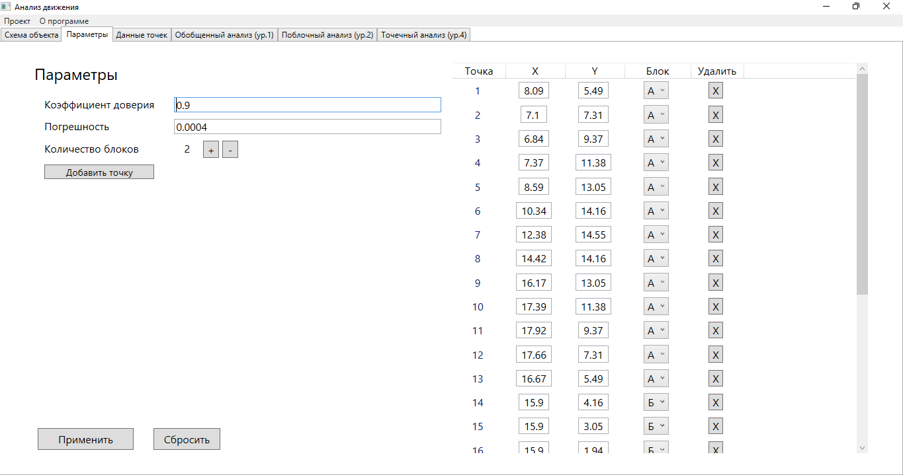
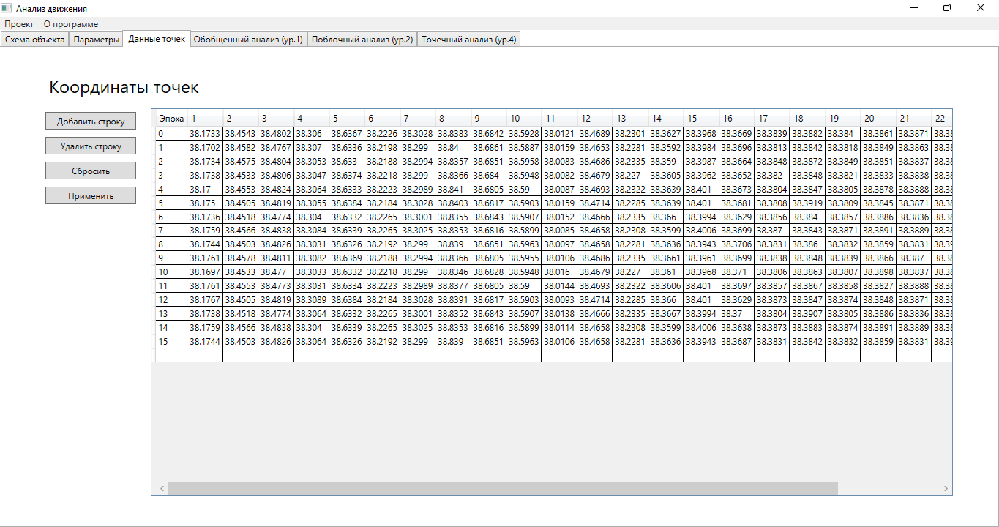

# Справка

Программа предназначена для анализа и прогнозирования модели технологического объекта по данным измерений высот некоторых его точек.

## Быстрый старт:

1. Создайте проект или загрузите уже готовый.

На начальном меню вам отобразится список проектов. Вы можете двойным щелчком или нажатием на кнопку "Открыть" загрузить его.
Если же у вас нет еще проектов:

то вам следует создать его!

Далее мы рассмотрим именно такой вариант.

2. Создание проекта

Для того, чтобы перейти к созданию проекта, нажмите на кнопку "Создать новый проект" на начальном меню или на пункт `Проект - Новый...` в верхней ленте.

Нажмите на "Открыть БД" и выберите вашу базу данных. Затем в выпадающем списке ниже выберите название таблицы с данными и нажмите "Загрузить".

### Важно!

Программа VARGEN генерирует БД с некорректным форматом данных в таблицах, что мешает их загрузить обычным способом. Если ваши данные из VARGEN не загружаются - нажмите на "Запустить исправление данных". Эта процедура исправит данные в БД, что позволит загрузить их в программу.

После загрузки данных высот точек перейдите к пунтку "Данные точек". Здесь появится список всех точек проекта. Вы можете вручную заполнить координаты точек и их распределение по точкам. Также вы можете загрузить эти данные из БД. Также необязательно указывать эти данные - вы можете просто оставить как есть и заполнить позже при необходимости.

Далее укажите параметры вашей системы - погрешность и коэффициент доверия исходным данным и нажмите "Создать"! Проект будет создан и открыт автоматически.

3. Готово! Ваш проект создан.

Теперь вы можете наблюдать и анализировать результаты рассчетов на разных уровнях (1, 2, 4). 

Также вы можете просматривать и изменять схему объекта:

Изменять значения параметров моделирования, изменять координаты точек и их распределение по блокам:

При необходимости, вы можете менять сами данные, добавлять и удалять эпохи:

## Верхнее меню

Верхнее меню содержит пункты:
* Проект
    * Сохранить - сохраняет все изменения данных в БД.
    * Закрыть - закрывает проект, переходит в начальное меню
    * Открыть... - также закрывает проект, переходит в начальное меню
    * Новый... - переходит в меню создания проекта
    * Выйти - завершает программу
* О программе
    * О программе - показывает общую информацию о программе
    
    * Справка - показывает подробную информацию о программе.

## Выбор проекта (начальный экран)

На списке проектов отображаются существующие проекты для быстрого доступа. Чтобы открыть его необходимо дважды кликнуть по пункту в списке, или выбрать пункт в списке и затем нажать кнопку 'Открыть'.

Кнопка `Создать новый проект...` открывает меню создания проекта.

Кнопка `Обновить список проектов` обновляет список проектов.

## Создание проекта

Меню создания проекта позволяет создать новый проект по данным из БД. Предназначен для чтения данных из таблиц, генерируемых программой VARGEN.

Верхние пункты меню позволяют: ввести название проекта (программа по умолчанию предлагает сгенерированные названия), вернуться к начальному меню.

### Список высот
Эпоха - это измерение данных в определенный дискретный момент времени. Эпоха набор измерений высот всех датчиков объекта.

Для создания проекта вам потребуется загрузить список наблюдений из базы данных SQLite со столбцами `[Эпоха]`, `[1]`, `[2]`, `[3]` и т.д., где первый столбец обозначает номер эпохи, а последующие - обозначают положения точек в эту эпоху. 

Для загрузки эпох, нажмите "Открыть БД", и выберите ваш файл базы данных. Далее, в выпадающем списке выберите название вашей таблицы с данными и нажмите "Загрузить". 
После этих действий, таблицы должны будут заполиться значениями из базы данных.

#### Важно! 
По умолчанию, VARGEN создает базы данных в некорректном формате. Это приводит к невозможности загрузить таблицу стандартным способом. В программе предусмотрена утилита, исправляющая такие базы данных - db_fix.exe. Для того, чтобы применить утилиту, перед нажатием на кнопку "Загрузить", нажмите на кнопку "Запустить исправление данных" и дождитесь диалогового окна с результатом. Если все пройдет успешно, то формат данных в таблице будет заменен на верный и вы сможете далее пользоваться этой БД обычным способом.

### Данные точек
Далее можете перейти к заполнению данных точек. 
Вы можете: загрузить готовые данные из БД, заполнить вручную или оставить данные пустыми. Вы всегда можете изменить их после создания проекта.

Чтобы данные из БД введите название вашей таблицы с данными в формате (Точка, X, Y, Блок) и нажмите "Загрузить из БД", чтобы выбрать файл.

### Параметры моделирования
Введите параметры - коэффициент доверия исходным данным и величину погрешности датчиков. 

### Финал
Далее проект будет автоматически создан и загружен. После этого, он также должен появиться в списке на начальном экране.

## Работа с проектом
После открытия проекта программа переходит в меню со следующими вкладками:
* Схема объекта
* Параметры
* Данные точек
* Обобщенный анализ (ур. 1)
* Поблочный анализ (ур. 2)
* Точечный анализ (ур. 4)

### 1. Схема объекта

Позволяет просматривать и изменять изображение схемы объекта. Если изображение отсутствует, пользователь может выбрать его через кнопку "Изменить изображение".
После применения/изменения изображения не требуется сохранять изменения, так как изменяется сам файл изображения в проекте. Возможно, этот недочет будет исправлен в будущем.

### 2. Параметры моделирования

Данная вкладка позволяет менять значения параметров моделирования, координат точек и распределение точек на блоки. Позволяет добавлять и удалять блоки.

Нажатие на `+` рядом с Количеством блоков добавит новый блок. Нажатие на `-` удалит последний блок и сбросит привязку блока со всех его точек.

Кнопка `Добавить точку` добавляет новую пустую точку в конец списка и пустой столбец в таблицу эпох (после нажатия на кнопку `Применить`).

После внесения любых изменений необходимо нажать на кнопку `Применить` для того, чтобы они вступили в силу. Важно! Нажатие на кнопку `Применить` не сохраняет изменения в файл, а лишь применяет их. Для того, чтобы сохранить все изменения в файл, нажмите на пункт `Проект - сохранить` в верхнем меню.

Нажатие на кнопку `Сбросить` сбрасывает все неподтверженные изменения и возвращает вкладку в исходное состояние.

### 3. Данные точек

Вкладка содержит таблицу эпох. Позволяет изменять значения высот, добавлять и удалять строки.

Для добавления новой строки по рассчетам необходимо нажать на кнопку `Добавить строку`. 
Для добавления строки по собственным значениям просто введите значения в последнюю пустую строку.

Кнопка `Удалить строку` удаляет последнюю строку из таблицы.

Кнопка `Сбросить` отменяет все изменения и возвращает таблицу в исходное состояние.

Кнопка `Применить` применяет все внесенные изменения. Важно! Нажатие на кнопку `Применить` не сохраняет изменения в файл, а лишь применяет их. Для того, чтобы сохранить все изменения в файл, нажмите на пункт `Проект - сохранить` в верхнем меню.

### 4. Вкладки анализа
Вкладки 
* Обобщенный анализ (ур. 1), 
* Поблочный анализ (ур. 2) и 
* Точечный анализ (ур. 4)

представляют пользователю результаты рассчетов на различных уровнях.

Первые два уровня предназначены для анализа движения всего объекта как целого и его блоков в частности. Уровни содержат рассчеты модулей и углов эпох-векторов, а также прогнозы и экспоненциальные сглаживания параметров и графики результатов. В соответствующих вкладках представлены все рассчеты, результаты и представление значений.

Четвертый уровень - Точечный анализ (ур.4) - представляет и прогнозирует данные высот по отдельным точкам объекта. Для того, чтобы просмотреть данные по одной их точек, следует открыть вкладку точечного анализа, и, в верхнем выпадающем списке, выбрать номер интересующей точки.

